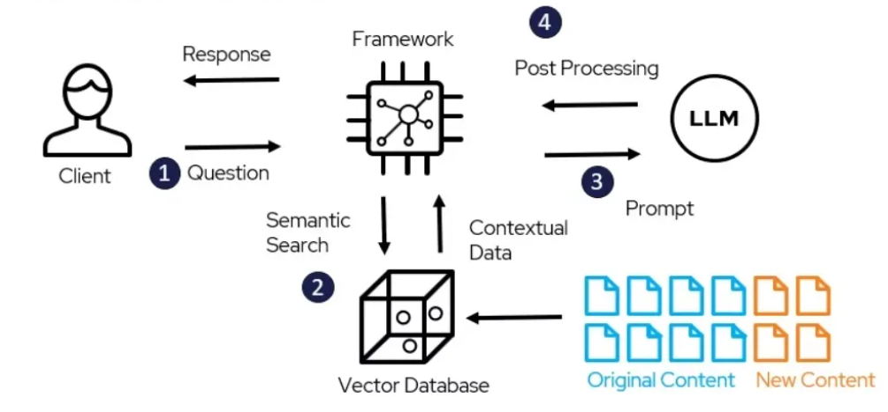

---
# Leveraging AI-Powered Knowledge Management Systems to Enhance Operational Efficiency
---

National Research and Education Networks (NRENs) play a crucial role in supporting academic and research communities
by providing advanced technological infrastructure and services. As these organizations grow in complexity, there is an
increasing need for efficient knowledge management systems to support their operations. This research project aims to explore
the potential of AI-powered knowledge management systems in enhancing the operational efficiency of NRENs, with a
focus on managing institutional knowledge, training materials, and administrative guidelines.

This research project aims to explore the potential of AI-powered knowledge management systems in enhancing the operational efficiency of NRENs, with a focus on managing:

- Institutional knowledge
- Training materials
- Administrative guidelines

## Research Objectives

- **Primary Goal**: Develop an AI-powered knowledge management system tailored for NREN operations
- **Focus Areas**: Institutional knowledge preservation, training material organization, administrative guideline accessibility
- **Target Outcome**: Enhanced operational efficiency through intelligent information retrieval and management

## Technical Architecture

### RAG (Retrieval-Augmented Generation) System

Our approach leverages RAG architecture to combine the benefits of large language models with domain-specific knowledge retrieval:



### Core Components

1. **Document Processing Pipeline**

   - Text extraction from various formats (PDF, DOC, HTML)
   - Chunking and preprocessing
   - Vector embedding generation

2. **Vector Database**

   - Semantic search capabilities
   - Efficient similarity matching
   - Scalable storage for large document collections

3. **Language Model Integration**
   - Context-aware response generation
   - Query understanding and refinement
   - Multi-turn conversation support

## Current Progress

### Completed Milestones

- **RAG Architecture Study**: Comprehensive analysis of Retrieval-Augmented Generation systems
- **Vector Embeddings Research**: Deep dive into semantic search and similarity matching techniques
- **Prototype Development**: Created small-scale chatbots for concept validation
- **Component Integration**: Successfully tested retrieval and generation workflows

## Technology Stack

### Language Models

- **Primary Requirement**: GPT-3.5 Turbo or GPT-4
- **Use Cases**:
  - Text generation and summarization
  - Query understanding and response synthesis
  - Context-aware information retrieval

### Vector Processing

- **Embedding Models**: OpenAI text-embedding-ada-002 or similar
- **Vector Database**: Pinecone, Weaviate, or Chroma
- **Similarity Search**: Cosine similarity, semantic matching

### Development Framework

```python
- Python 3.8+
- LangChain for LLM orchestration
- OpenAI API for language models
- Vector database (Pinecone/Weaviate)
- FastAPI for backend services
- React/Next.js for frontend interface
```

## Get Started

1. Clone this repository:
   ```bash
   git clone https://github.com/cepdnaclk/e19-4yp-AI-Powered-Knowledge-Management-System.git
   ```
